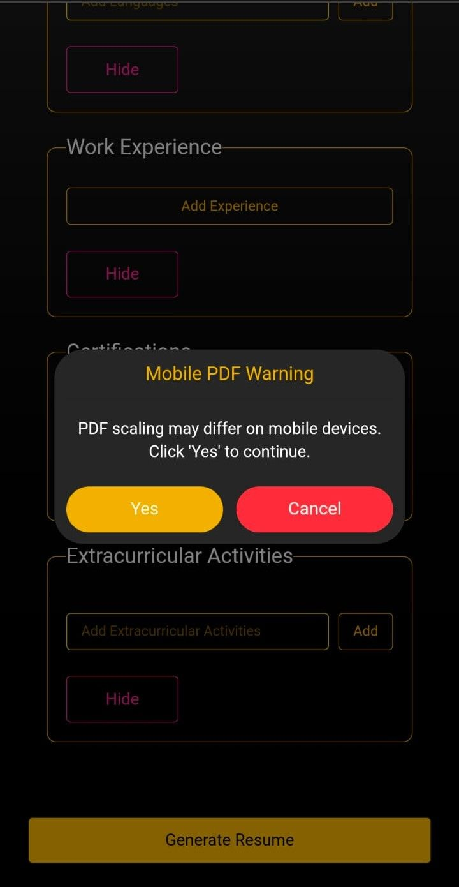

# Hire-Radar

A comprehensive platform aiming to streamline job-hiring processes, bringing together employers and candidates in an efficient, user-friendly web application.

---

## Features
- Candidate registration, profile management and resume upload capabilities  
- Employer dashboard: post jobs, review applications, manage listings  
- Job search & filter functionality for candidates  
- Real-time notifications / status updates for application progress  
- Admin panel (optional) for site-wide moderation and control  
- Responsive UI supporting multiple device form-factors  
- Secure authentication & authorization (user roles: candidate, employer, possibly admin)  
- RESTful backend API and decoupled frontend architecture  

---

## Demo / Live Link
Visit the live deployment here: [Hire-Radar Live](https://hire-radar.vercel.app)



---

## Tech Stack
- **Frontend**: JavaScript, React  
- **Backend**: Python (Flask/Django)
- **Database**: Firebase  
- **Styling**: CSS, TailWind CSS, Daisy UI  
- **Authentication**: Firebase Auth  
- **Hosting/Deployment**: Vercel (frontend)  

---

## Architecture & Structure

Hire-Radar/
├───client
│   ├───.dist
│   ├───public
│   └───src
│       ├───api
│       ├───assets
│       │   └───animations
│       ├───components
│       │   └───auth
│       ├───context
│       ├───css
│       ├───data
│       ├───pages
│       ├───section
│       │   └───Resume Generator
│       └───utils
└───server
    ├───fonts
    └───model

---

## Installation & Setup

### 1. Clone the repository
```bash
git clone https://github.com/Dev1903/Hire-Radar.git
cd Hire-Radar
```

---

## FrontEnd Setup
```bash
cd client
npm install
npm run dev
```

---

## Backend Setup
```bash
cd ../server

# Install dependencies
pip install -r requirements.txt  # if Python backend

# Start the backend server
python app.py
```

---

## Usage

1. Create an account

2. Navigate through our services Resume Maker, Job Search, ATS Score Check

3. Provide us with a little review of any inconvenience or praise

---

## Contributing

Contributions are welcome! Follow these steps:

- Fork the repository

- Create a new branch
```bash
git checkout -b feature/your-feature
```

- Commit and push your changes
```bash
git commit -m "Add new feature"
git push origin feature/your-feature
```

- Open a Pull Request

- Please make sure to update documentation and tests if applicable.

---

## Contact

Author: [Dev1903](https://github.com/Dev1903), [Sneha-jana](https://github.com/Sneha-jana), [Deba8016](https://github.com/Deba8016)

Feel free to reach out for questions, suggestions, or collaboration opportunities.
